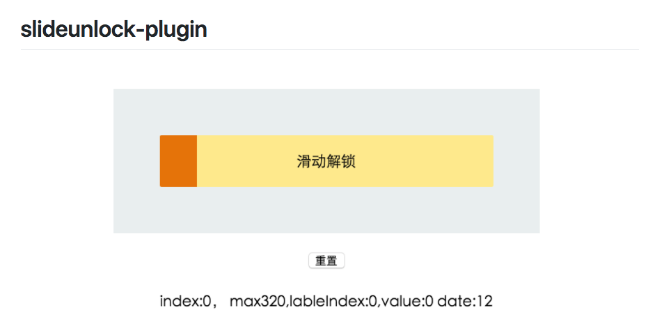
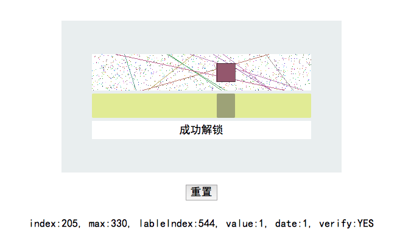
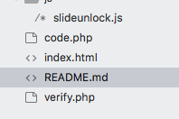

# 图片滑动解锁

## 介绍

滑动解锁作为一种较新的验证方式,以其方便快捷简单的特点,迅速成为目前较为流行的验证方式;而图片滑动解锁比滑动解锁更加高效安全,成为现代最为流行的用户验证方式

###  本组件3基于 ArronYR / slideunlock-plugin (github) 滑动解锁组件;进行升级开发,实现了图片滑动解锁的核心功能

## 主要技术点
1.图片的绘制(code.php)
2.小滑块的滑动,停止报送滑块位置(slideunlock.js)
3.滑动位置检测,登录状态记录(verify.php)

## 文件地址

[github](https://github.com/jxj322991/verify_user)

## 演示地址

[点击](http://jxjweb.sc2yun.com/verify/)